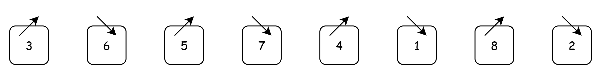
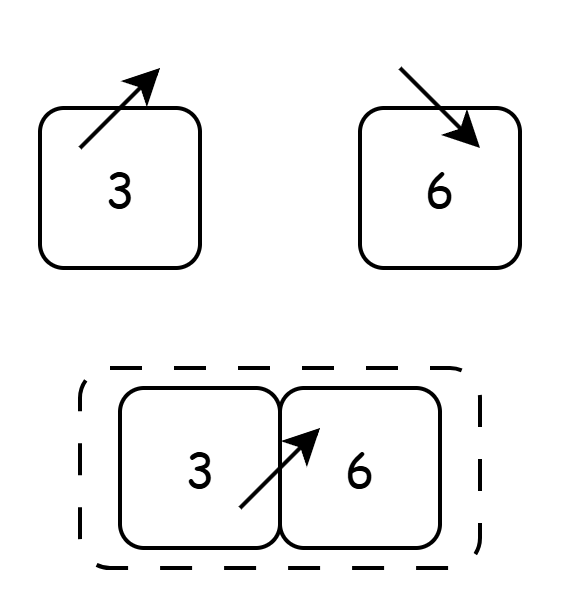
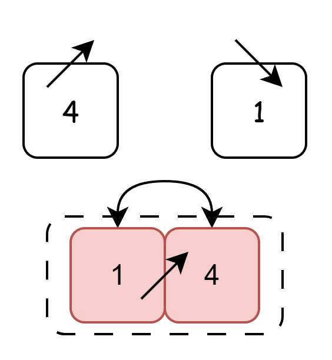
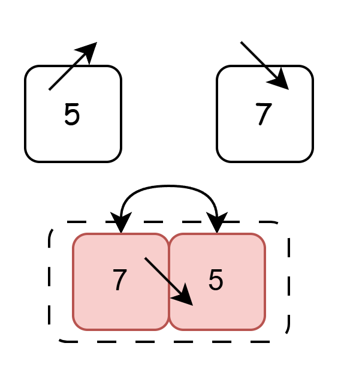
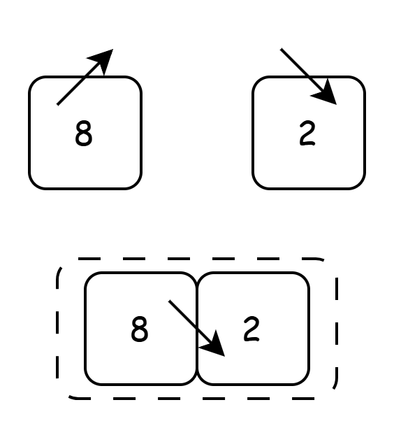
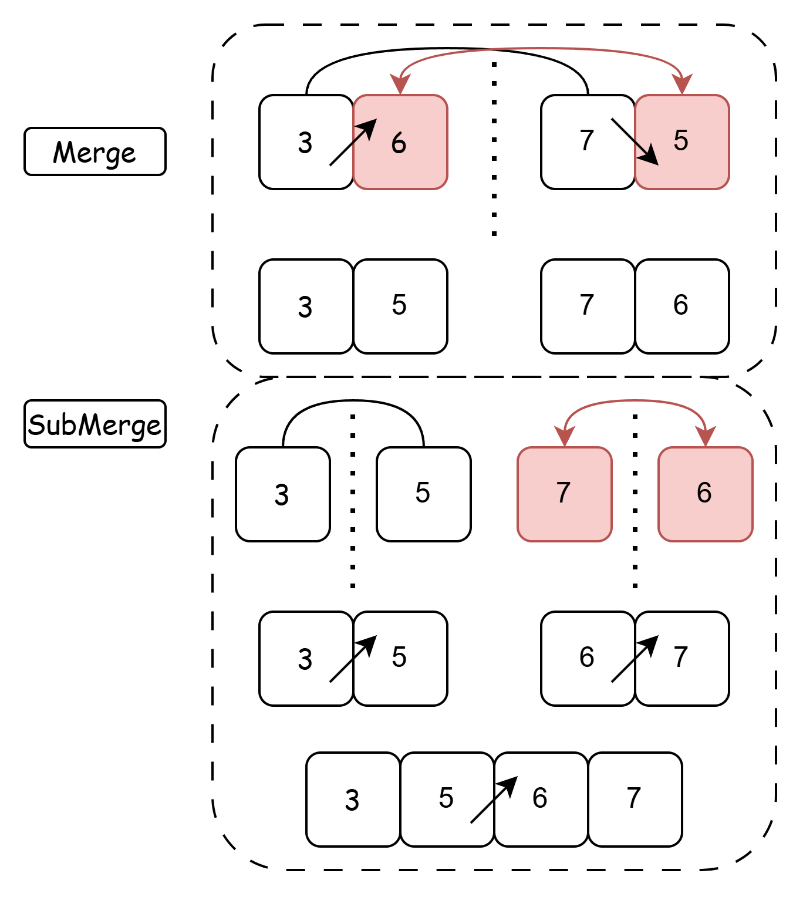
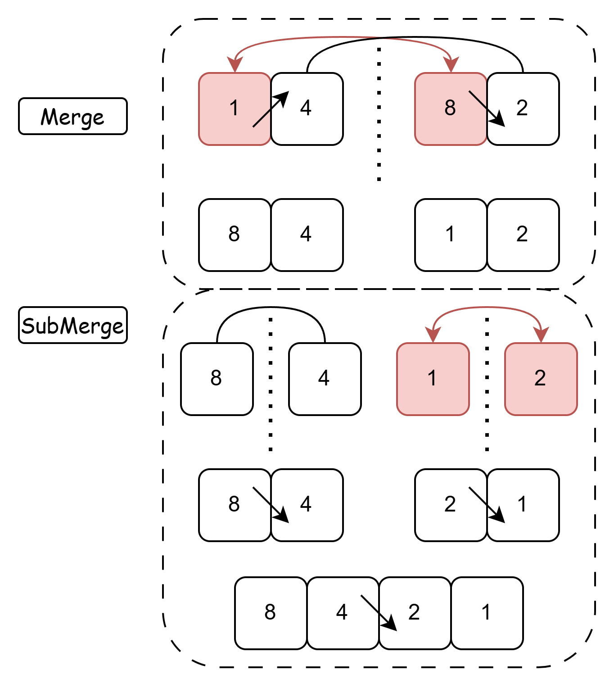
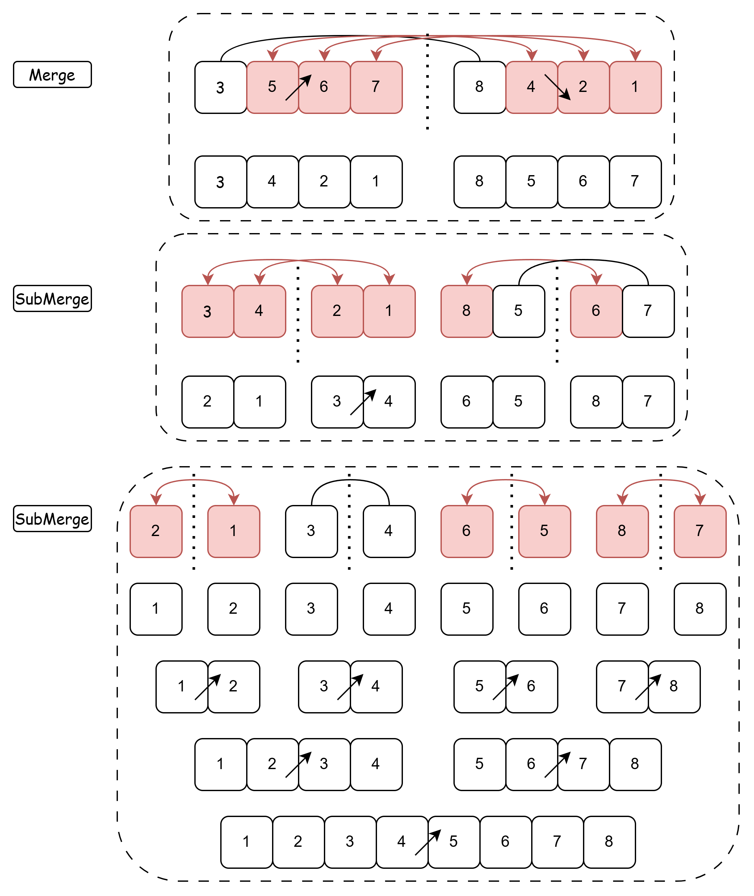

## Bitonic Sort

Bitonic sort is a sorting algorithm that supports parallel computation. Because it uses only simple comparisons and swaps, it is suitable for sorting large numbers of elements on architectures with many parallel execution units, such as GPUs and NPUs.

Sorting generally consists of two steps. The first step splits the array into bitonic sequences from top to bottom. The second step merges these sequences into a single monotonic sequence from bottom to top. The following sections explain what bitonic sequences are and the splitting and merging process.

### Bitonic Sequences

A bitonic sequence is a sequence of numbers that is initially monotonically increasing and then monotonically decreasing (or initially monotonically decreasing and then monotonically increasing). For example, the following three data sets can all be considered bitonic sequences:

1. When the data size of the increment and decrement are the same:
`[1, 4, 5, 6, 3, 2]`: ↗↘ (1, 4, 5) increase, (6, 3, 2) decrease
`[8, 2, 1, 3]`: ↘↗↘↗ (8, 2) decrease, (1, 3) increase
2. When the data size of the increment and decrement are different:
`[1, 2, 4, 7, 6, 3]`: ↗↘ (1, 2, 4, 7) increase, (6, 3) decrease
3. When the increment and decrement are 0:
`[1, 2, 3]`: ↗(1, 2, 3) increase, (() decrease)
`[6]`: ↗(6) increase, (() decrease) \[or ↘() for increasing, (6) for decreasing]

From the above three sets of bitonal sequences, we can summarize the definition of a bitonal sequence (taking an increasing-then-decreasing sequence as an example). For a sequence nums, there exists an index $i$, and the sequence is monotonically increasing for all elements `nums[:i]` with indices less than or equal to $i$, and monotonically decreasing for all elements `nums[i:]` with indices greater than or equal to $i$.

### Comparison and Swap

Comparison and swap are an essential part of the bitonal sorting process and require multiple operations throughout the entire process. For two numbers to be compared, `nums[i]` and `nums[j]`, the processing logic for increasing and decreasing sequences is defined as follows:

1. `nums[i]` and `nums[j]` are increasing sequences.
- `nums[i] > nums[j]` -> `swap(nums[i], nums[j])`
- `nums[i] <= nums[j]` -> `do nothing`
2. `nums[i]` and `nums[j]` are decreasing sequences.
- `nums[i] < nums[j]` -> `swap(nums[i], nums[j])`
- `nums[i] >= nums[j]` -> `do nothing`

### Creating a Succession of Bittone Sequences

Bittone sequences allow you to divide any data set into a combination of bittone sequences. For simplicity, we won't consider the odd case here.

For example, let's take the set `[3, 6, 5, 7, 4, 1, 8, 2]`. First, divide it in half.

`[3, 6, 5, 7]`, `[4, 1, 8, 2]`. Then, divide each portion in half again:

`[3, 6]`, `[5, 7]`, `[4, 1]`, `[8, 2]`. Then, divide each portion in half again:

`[3]`, `[6]`, `[5]`, `[7]`, `[4]`, `[1]`, `[8]`, `[2]`.

Based on the third example of bitonic sequences (increasing and decreasing data are 0), this dataset can be viewed as a succession of combinations of increasing and decreasing sequences.

### Bitonic Merge

Bitonic merge is the second step in bitonic sorting. Its function is to combine groups of bitonic sequences into new groups of monotonic sequences, ultimately forming a monotonic sequence (which is also a bitonic sequence). It is important to note that each merged sequence must be a bitonic sequence, and the result after one merge must be strictly monotonic. Take `[3, 6, 5, 7, 4, 1, 8, 2]` as an example. Since this is already divided into eight monotonic sequence groups,...

- Step 1: Combine pairs of sequences to create four bitonic sequences. When combined, they form four monotonic sequences, i.e., eight 1s combine into four 2s.

- Step 2: Combine four monotonic sequences to create two bitonic sequences. When combined, they form two monotonic sequences, i.e., four 2s combine into two 4s.

- Step 3: Combine the two monotone sequences to create a single bittone sequence. Combining results in a single monotone sequence, i.e., two 4s combined into one 8.

The combining rule is that the nth combination sorts the results in ascending order, and the (n+1)th combination sorts the results in descending order. Split the bittone sequence in half, compare each digit, and perform the compare and swap in ascending (or descending) order according to the rules described in "Compare and Swap." Next, split one half of the swapped data in half again and perform the compare and swap in ascending (or descending) order. Repeat this process for the remaining half until the smallest comparable unit is reached. The final combination is the result.

> Smallest comparable unit: This refers to the case where only two numbers are compared, since no further comparisons are required to split into a single number.

#### Merge 1 and 2

For the input data, the pair combinations from left to right are `[3][6]`, `[5][7]`, `[4][1]`, `[8][2]`. The combination rule states that "the nth merge results in ascending order, and the n+1th merge results in descending order."

##### The first and third merges remain in ascending order.

The comparison and swap rule states that, in ascending order, if `a > b`, `a` and `b` are swapped, and if `a <= b`, they are left unchanged. Therefore, when comparing 3 and 6, they are left unchanged. When comparing 4 and 1, a swap is performed. This is already the smallest comparison unit, so no further division is necessary.

##### The second and fourth merges remain in descending order.

Following the compare and swap rules, in descending order, if `a < b`, swap `a, b`; if `a >= b`, leave it unchanged. Therefore, comparing 8 and 2 leaves it unchanged. Comparing 5 and 7 results in a swap. Since this is already the smallest comparison unit, no further division is necessary.

##### Merge Result

The merged result is `[3, 6]` `[7, 5]` `[1, 4]` `[8, 2]`.

#### Merges 2 to 4

The input data `[3, 6]`, `[7, 5]`, `[1, 4]`, and `[8, 2]` are combined pairwise from left to right according to the following combination rule: "The nth merge produces an ascending result, and the (n+1)th merge produces a descending result."

##### The first merge maintains the ascending order.

In the ascending sequence, 3 and 7 are left unchanged, and 6 and 5 are swapped, resulting in `[3, 5, 7, 6]`. Because the current result is not the smallest comparison unit, two submerges are performed to split the sequence in half before continuing the merge. The submerges compare and leave 3 and 5 unchanged, and swap 7 and 6. The final result is `[3, 5, 6, 7]`.

##### Second merge, maintaining descending order

In a descending sequence, 4 and 2 remain unchanged, and 1 and 8 are swapped, resulting in `[8, 4, 1, 2]`. Because the current result is not the smallest comparison unit, two submerges are performed, splitting the sequence in half before continuing the merge. During the submerges, 8 and 4 are compared and left unchanged, but 1 and 2 are swapped. The final result is `[8, 4, 2, 1]`.

##### Merge Result

The merge result is `[3, 5, 6, 7]` `[8, 4, 2, 1]`.

#### Merging 4 and 8

Compare each element of the bitonic sequences `[3, 5, 6, 7]` `[8, 4, 2, 1]`. Because only one merge remains, this merge maintains ascending order.

##### Ascending Merge

Following the increasing exchange rule, the first merge leaves 3 and 8 unchanged, but must exchange 5 and 4, 6 and 2, and 7 and 1. If the current result is not the smallest granularity, perform the SubMerge operation twice. For `[3, 4, 2, 1]`, you need to swap 3 and 2, and 4 and 1. For `[8, 5, 6, 7]`, you need to swap 8 and 6. If the result is still not a granular comparison after the SubMerge operation, perform two more SubMerge operations for each SubMerge, swapping 2 and 1, 6 and 5, and 8 and 7.

##### Result after Merging

The result after merging is `[1, 2, 3, 4, 5, 6, 7, 8]`.

Thus, by performing three Merge operations and multiple SubMerge operations, you can obtain a monotonically ordered sequence. ### Advantages and Disadvantages

- Advantages: Supports parallel processing, high sorting efficiency (low calculation time), supports tile-based calculations.

- Disadvantages: Execution speed slows in non-parallel scenarios, requires large amounts of input data (n = 2^k), and algorithm implementation is relatively complex.